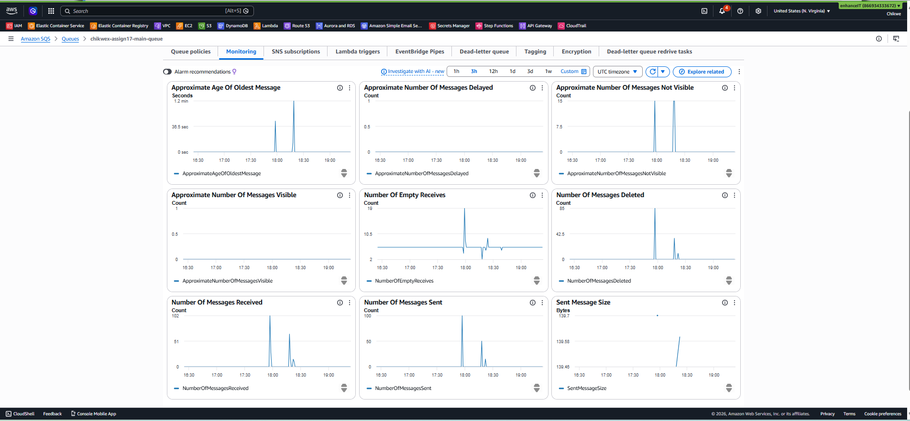

# Assignment 17 — SQS Dead Letter Queue Processing

## Overview

Robust SQS message processing with retry logic and Dead Letter Queue handling. A consumer Lambda processes messages from `main-queue` and randomly fails 20% of them. Failed messages are retried up to 3 times before being routed to the DLQ. A second Lambda monitors the DLQ, logs failure patterns, and sends SNS alerts. A replay script pushes DLQ messages back to the main queue for reprocessing. A FIFO queue variant with content-based deduplication is also provisioned.

---

## Architecture

```text
                         Producer
                            │
                            ▼
               ┌────────────────────────┐
               │  chikwex-assign17-     │ ◄── replay.py
               │  main-queue            │     (DLQ → main-queue)
               │  visibility: 30s       │
               │  maxReceiveCount: 3    │
               └───────────┬────────────┘
                           │ SQS trigger (batch=1)
               ┌───────────▼────────────┐
               │  consumer Lambda       │
               │  • 80% SUCCESS         │
               │  • 20% FAIL (raise)    │
               └───────────┬────────────┘
                           │ fail × 3
                           ▼
               ┌────────────────────────┐
               │  chikwex-assign17-     │
               │  failed-messages (DLQ) │
               └───────────┬────────────┘
                           │ SQS trigger (batch=10)
               ┌───────────▼────────────┐
               │  dlq-monitor Lambda    │
               │  • logs failure report │
               │  • publishes SNS alert │
               └───────────┬────────────┘
                           │
               ┌───────────▼────────────┐
               │  SNS → Email alert     │
               │  chikwe.azinge@techconsulting.tech  │
               └────────────────────────┘
```

---

## Queue Configuration

| Setting | `main-queue` | `failed-messages` (DLQ) |
| --- | --- | --- |
| Type | Standard | Standard |
| Visibility timeout | 30 s | 30 s |
| Max receive count | 3 | — |
| Redrive policy | → DLQ | — |
| Message retention | 4 days | 14 days |

A FIFO variant (`main-queue.fifo` + `failed-messages.fifo`) is also provisioned with content-based deduplication enabled.

---

## Project Structure

```text
├── README.md
├── lambda/
│   ├── consumer/
│   │   └── handler.py       # 20% random fail, logs every attempt
│   └── dlq_monitor/
│       └── handler.py       # analyzes failures, publishes SNS alert
├── terraform/
│   ├── main.tf              # SQS, FIFO, SNS, Lambda, IAM, event source mappings
│   ├── variables.tf
│   ├── outputs.tf
│   └── terraform.tfvars
└── scripts/
    ├── send_messages.py     # Send 100 test messages to main-queue
    └── replay.py            # Move messages from DLQ back to main-queue
```

---

## Prerequisites

- Terraform >= 1.5
- AWS CLI configured (`us-east-1`)
- Python 3.9+ with `boto3` (`pip install boto3`)

---

## Deployment

### Step 1 — Deploy infrastructure

```powershell
cd terraform
terraform init
terraform apply -auto-approve
```

Note the outputs:

```text
main_queue_url     = "https://sqs.us-east-1.amazonaws.com/866934333672/chikwex-assign17-main-queue"
dlq_url            = "https://sqs.us-east-1.amazonaws.com/866934333672/chikwex-assign17-failed-messages"
fifo_main_queue_url = "...chikwex-assign17-main-queue.fifo"
sns_topic_arn      = "arn:aws:sns:us-east-1:866934333672:chikwex-assign17-dlq-alerts"
```

> **Confirm the SNS email subscription** — AWS sends a confirmation email to `chikwe.azinge@techconsulting.tech`. Click the link before testing or alerts won't deliver.

### Step 2 — Send 100 messages

```powershell
python scripts/send_messages.py --queue-url https://sqs.us-east-1.amazonaws.com/866934333672/chikwex-assign17-main-queue --count 100
```

This sends 100 messages in batches of 10. The consumer Lambda processes them immediately. Expect ~20 to fail all 3 attempts and land in the DLQ within a few minutes.

### Step 3 — Monitor DLQ depth

```powershell
aws sqs get-queue-attributes `
  --queue-url https://sqs.us-east-1.amazonaws.com/866934333672/chikwex-assign17-failed-messages `
  --attribute-names ApproximateNumberOfMessages `
  --region us-east-1
```

### Step 4 — Replay DLQ messages

Once messages are in the DLQ, replay them back to the main queue:

```powershell
python scripts/replay.py `
  --dlq-url https://sqs.us-east-1.amazonaws.com/866934333672/chikwex-assign17-failed-messages `
  --target-url https://sqs.us-east-1.amazonaws.com/866934333672/chikwex-assign17-main-queue
```

The replay script drains the DLQ, re-sends each message to `main-queue`, and deletes it from the DLQ only after successful re-queue. The consumer Lambda will process them again (same message IDs will fail again due to seeded RNG — this is by design to demonstrate replay behaviour).

---

## FIFO Queue — Deduplication

The FIFO queues use content-based deduplication. To send a deduplicated message:

```powershell
$FIFO_URL = terraform -chdir=terraform output -raw fifo_main_queue_url

aws sqs send-message `
  --queue-url $FIFO_URL `
  --message-body '{"id":"msg-001","category":"orders"}' `
  --message-group-id "orders" `
  --region us-east-1
```

Duplicate messages with the same body sent within a 5-minute deduplication window are discarded automatically.

---

## Checking Results

### Consumer Lambda logs (success + failure attempts)

```powershell
aws logs tail /aws/lambda/chikwex-assign17-consumer --follow --region us-east-1
```

Look for:

```text
ATTEMPT messageId=... attempt=1
SUCCESS messageId=...
FAIL    messageId=... attempt=1 — simulated processing error
ATTEMPT messageId=... attempt=2
FAIL    messageId=... attempt=2 — simulated processing error
ATTEMPT messageId=... attempt=3
FAIL    messageId=... attempt=3 — simulated processing error
→ message moves to DLQ
```

### DLQ monitor Lambda logs

```powershell
aws logs tail /aws/lambda/chikwex-assign17-dlq-monitor --follow --region us-east-1
```

Look for `DLQ_ARRIVAL` and `DLQ_SUMMARY` lines showing failure counts by category.

---

## Success Criteria

| Criteria | How to verify |
| --- | --- |
| Failed messages move to DLQ after 3 attempts | CloudWatch consumer logs show 3 `FAIL` lines per message, then DLQ depth increases |
| DLQ monitor Lambda triggers correctly | CloudWatch dlq-monitor logs show `DLQ_ARRIVAL` events |
| SNS alert received | Email to `chikwe.azinge@techconsulting.tech` with failure summary |
| Replay mechanism works | `replay.py` drains DLQ and main-queue depth increases |

---

## Observed Test Results

### Run 1 — 2026-05-06 (initial deployment)

| Metric | Observed |
| --- | --- |
| Messages sent | 100 |
| Failed all 3 attempts → DLQ | 22 |
| DLQ_ARRIVAL events logged | 22 |
| SNS alerts published | 22 |
| Messages replayed from DLQ | 10 |

Evidence: `screenshots/12-consumer-lambda-logs.json`, `screenshots/13-dlq-monitor-lambda-logs.json`, `screenshots/14-replay-output.txt`

### Run 2 — 2026-05-18 (re-run to refresh expired logs)

| Metric | Observed |
| --- | --- |
| Messages sent | 150 (100 + 50) |
| ATTEMPT log lines captured | 81 |
| SUCCESS log lines | 34 |
| FAIL log lines | 8 (sampled) |
| DLQ_ARRIVAL events logged | 15 |
| SNS alerts published | 14 |
| Messages replayed from DLQ | 15 (DLQ 15 → 0) |

Evidence: `screenshots/15-consumer-lambda-logs-fresh.json`, `screenshots/16-dlq-monitor-logs-fresh.json`, `screenshots/17-replay-output-fresh.txt`



---

## AWS Console Links

| Resource | Link |
| --- | --- |
| main-queue | [chikwex-assign17-main-queue](https://us-east-1.console.aws.amazon.com/sqs/v3/home?region=us-east-1#/queues/https%3A%2F%2Fsqs.us-east-1.amazonaws.com%2F866934333672%2Fchikwex-assign17-main-queue) |
| failed-messages (DLQ) | [chikwex-assign17-failed-messages](https://us-east-1.console.aws.amazon.com/sqs/v3/home?region=us-east-1#/queues/https%3A%2F%2Fsqs.us-east-1.amazonaws.com%2F866934333672%2Fchikwex-assign17-failed-messages) |
| FIFO main queue | [chikwex-assign17-main-queue.fifo](https://us-east-1.console.aws.amazon.com/sqs/v3/home?region=us-east-1#/queues/https%3A%2F%2Fsqs.us-east-1.amazonaws.com%2F866934333672%2Fchikwex-assign17-main-queue.fifo) |
| consumer Lambda | [chikwex-assign17-consumer](https://us-east-1.console.aws.amazon.com/lambda/home?region=us-east-1#/functions/chikwex-assign17-consumer) |
| dlq-monitor Lambda | [chikwex-assign17-dlq-monitor](https://us-east-1.console.aws.amazon.com/lambda/home?region=us-east-1#/functions/chikwex-assign17-dlq-monitor) |
| SNS topic | [chikwex-assign17-dlq-alerts](https://us-east-1.console.aws.amazon.com/sns/v3/home?region=us-east-1#/topic/arn:aws:sns:us-east-1:866934333672:chikwex-assign17-dlq-alerts) |
| CloudWatch Logs (consumer) | [consumer log group](https://us-east-1.console.aws.amazon.com/cloudwatch/home?region=us-east-1#logsV2:log-groups/log-group/%2Faws%2Flambda%2Fchikwex-assign17-consumer) |
| CloudWatch Logs (dlq-monitor) | [dlq-monitor log group](https://us-east-1.console.aws.amazon.com/cloudwatch/home?region=us-east-1#logsV2:log-groups/log-group/%2Faws%2Flambda%2Fchikwex-assign17-dlq-monitor) |

---

## Cleanup

```powershell
terraform destroy -auto-approve
```
